# 1.Introduction

## 1.5. Data Structures

📌**What is Static Array?**

- It is the most common data structure.
- It is simply a contiguous sequence of words reserved in memory, supporting a static sequence interface.

It have following interfaces:

`StaticArray(n)`  ->  allocate a new static array of size $n$ initialized to 0 in $\Theta(n)$ time

`StaticArray.get_at(i)`  ->  return the word stored at array index $i$ in $\Theta(1)$ time 

`StaticArray.set_at(i, x)`  ->  write the word $x$ to array index $i$ in $\Theta(1)$ time


## 1.6. Runtime Analysis

📌 **Disclaimer**

Runtime analysis only *approximates* it! It cares the degree and coefficient of $n$ the most.


📌**Analysis of birthday match algorithm**

All the lines take constant time except for following lines with heavy computation:

- `record = StaticArray(n)` , this takes $\Theta(n)$ time to initialize the static array record.
- `for i in range(n)`, in worst case, it will loop at most $n$ times
- `for j in range(i)`, it will loop through $k$ times

:star: Here is the key: in the worst case, we have to loop over $n$ times, in the meantime, inside the $n$ loop, we have to check $k,k-1,k-2,k-3,...,0$. Hence the operation can be represented as following abstract chart.

```
⬤
⬤⬤
⬤⬤⬤
⬤⬤⬤⬤
⬤⬤⬤⬤⬤
⬤⬤⬤⬤⬤⬤
```

Therefore, it could be written as:
$$
\Omicron(n)+\sum_{k=0}^{n-1}(\Omicron(1)+k\cdot\Omicron(1))=\Omicron(n^2)
$$
:thinking: OK, you may wonder, why left hand side becomes $n^2$ (square)?! while the chart above is a triangle??

That's the disclaimer said - *approximate*. Because these 2 `for` loop can be seen as
$$
\frac{n\cdot(n-1)}{2}\approx n^2
$$
This is quadratic in $n$, which is **polynomial**! Is this efficient? No! We **can do better** by using a different data structure tailored to support a different set of operations efficiently.


## 1.7. Asymptotic Exercises

___

:page_facing_up: **Question**: 

Find a simple, tight asymptotic bound for $\Big(\begin{matrix}n\\6006\end{matrix}\Big)$.

:pencil2:**Solution:** 

Definition yields $n(n-1)...(n-6005)$ in the numerator (a degree 6006 polynomial) and 6006! in the denominator (constant with respect to $n$). So:
$$
\Big(\begin{matrix}n\\6006\end{matrix}\Big)=\Theta(n^{6006})
$$


___

:page_facing_up: **Question**: 

 Find a simple, tight asymptotic bound for $\log_{6006}\Big((\log(n^{\sqrt{n}}))^2\Big)$

:pencil2:**Solution:** 

First, we have rules for exponent and logarithm rules:
$$
\begin{align}
\log ab&=\log a+\log b\\
\log(a^b)&=b\log a\\
\log_ab&=\log b/\log a
\end{align}
$$
Therefore, we have:
$$
\begin{align}
\log_{6006}\Big((\log(n^{\sqrt{n}}))^2\Big) &=\\
&=\frac{\log(\log(n^{\sqrt{n}})^2)}
{\log6006}
\\
&=\frac{2\log(\log(n^{\sqrt{n}}))}
{\log6006}
\\
&=\frac{2}
{\log6006}\log(\log(n^{\sqrt{n}}))
\\
&=\frac{2}
{\log6006}\log(\sqrt{n}\log(n))
\\
&\approx\log(\sqrt{n}\log(n))
\\
&\approx\Theta(\log n^{1/2}+\log\log n)
\\
&\approx\Theta(\log n)
\end{align}
$$

For $\approx$, we should know:
$$
\frac{2}{\log6006}=\frac{2}{3.77}\approx1
\\
\log\log n\approx0
\\
\log n^{1/2}=\frac{1}{2}\log n\approx\log n
$$


___

:page_facing_up: **Question**: 

Show that $2^{n+1}\in\Theta(2^n)$, but that $2^{2^{n+1}}\not\in\Omicron(2^{2^n})$

:pencil2:**Solution:** 

$\Theta$, tight bound, **as fast as**

$\Omicron$, upper bound, **no faster than**

Therefore, we have to prove 

​	A.    $2^{n+1}$ **can** grow faster **or** slower than $2^n$:

Because $2^{n+1}=2\cdot2^n$, therefore $2^{n+1}$ bigger than $2^n$

​	B.    $2^{2^{n+1}}$ **MUST** grow faster than $2^{2^n}$:

Because $2^{2^{n+1}}=2^{2^n}\cdot2^2$, therefore $2^{2^{n+1}}$ bigger than $2^{2^n}$


___

:page_facing_up: **Question**: 

Show that $(\log n)^a=\Omicron(n^b)$ for all positive constants $a$ and $b$.

:pencil2:**Solution:** 

$\Omicron$, upper bound, **no faster than**

Therefore, to prove this, we have to say $(\log n)^a<n^b$ is always true. That said, if $n$ approaches $\infin$, this is true.

Goal of proof:
$$
\frac{n^b}{(\log n)^a} \to\infin\quad,\text{as } n\to\infin
$$
To prove:
$$
\begin{align}
\lim_{n\to\infin}\log(\frac{n^b}{(\log n)^a})&=\lim_{n\to\infin}(b\log n-a\log\log n)\\
&=\lim_{x\to\infin}(bx-a\log x)\\
&=\infin
\end{align}
$$


___

:page_facing_up: **Question**: 

Show that $(\log n)^{\log n}=\Omega(n)$

:pencil2:**Solution:** 

Since $m^m=\Omega(2^m)$, so setting $n=2^m$ completes the proof.


___

:page_facing_up: **Question**: 

Show that $(6n)!\not\in\Theta(n!)$, but that $\log((6n)!)\in\Theta(\log(n!))$

:pencil2:**Solution:** 

Sterling's approximation:
$$
n!=\sqrt{2\pi n}\Big(\frac{n}{e}\Big)^n\Bigg(1+\Theta(\frac{1}{n})\Bigg)
$$
Substituting in $6n$ gives an expression that is at least $6^{6n}$ larger than the original. But taking the logarithm of Sterling’s gives $\log(n!) = \Theta(n \log n)$, and substituting in $6n$ yields only constant additional factors.


# 2.Data Structures


## 2.1. Sequence Interface

📌**What is a sequence?**

Sequences maintain a collection of items in an **extrinsic** order, where each item stored has **a rank in the sequence**, including a first item and a last item.

📌**What does it mean by `extrinsic`?**

By extrinsic, we mean that the first item is ‘first’, not because of what the item is, but **because some external party put it there**. In short, the first is because it is THE first.

📌**Properties of sequence**

Therefore, we can conclude that the sequence interface has following properties:

- :one:Maintain a sequence of items (order is **extrinsic**)    e.g. ($x_0,x_1,x_2,...,x_{n−1}$) (zero indexing)
- :two:Use $n$ to denote the number of items stored in the data structure
- :three:Supports following operations:

| Function Categories | Function                                                     | Function Description                                         |
| ------------------- | ------------------------------------------------------------ | ------------------------------------------------------------ |
| Container           | `build(X)`<br />`len()`                                      | given an iterable $X$ build sequence from items in $X$ <br/>return the number of stored items |
| Static              | `iter_seq()`<br/>`get_at(i)`<br/>`set_at(i, x)`              | return the stored items one-by-one in sequence order<br/>return the $i^{th}$ item<br/>replace the $i^{th}$ item with $x$ |
| Dynamic             | `insert_at(i, x)`<br/>`delete_at(i)`<br/>`insert_first(x)`<br/>`delete_first()`<br/>`insert_last(x)`<br/>`delete_last()` | add $x$ as the $i^{th}$ item <br/>remove and return the $i^{th}$ item <br/>add $x$ as the first item <br/>remove and return the first item <br/>add $x$ as the last item <br/>remove and return the last item |

**📌Special case of sequence: `stack` and `queue`**

Sequences are generalizations of `stacks` and `queues`, which support a subset of sequence operations. The hierarchy is the following:

<center>
<figure>
  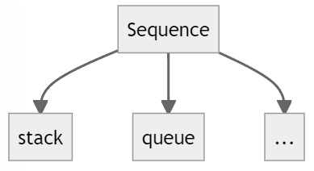
  <figcaption>Fig. Hierarchy of stack and queue.</figcaption>
</figure>
</center>

`stack` supports:

- `insert_last(x)`
- `delete_last()`

`queue` supports:

- `insert_last(x)`
- `delete_first()`


## 2.2. Set Interface

📌**What is a set?**

Sets maintain a collection of items based on an **intrinsic** property.

📌**What does it mean by `intrinsic`?**

By intrinsic, it means what the items are, usually based on a unique key, `x.key`, associated with each item `x`.

📌**Properties of set**

Therefore, we can conclude that the set interface has following properties:

- :one:Maintain a set of items having **unique** keys:    e.g. item `x` has key `x.key`   
- :two:Supports following operations:

| Function Categories | Function                                                     | Function Description                                         |
| ------------------- | ------------------------------------------------------------ | ------------------------------------------------------------ |
| Container           | `build(x)`<br/>`len()`                                       | given an iterable $X$, build set from items in $X$<br/>return the number of stored items |
| Static              | `find(k)`                                                    | return the stored item with key `k`                          |
| Dynamic             | `insert(x)`<br/>`delete(k)`                                  | add `x` to set (replace item with key `x.key` if one already exists)<br/>remove and return the stored item with key `k` |
| Order               | `iter_ord()`<br/>`find_min()`<br/>`find_max()`<br/>`find_next(k)`<br/>`find_prev(k)` | return the stored items one-by-one in key order <br/>return the stored item with smallest key <br/>return the stored item with largest key <br/>return the stored item with smallest key larger than `k` <br/>return the stored item with largest key smaller than `k` |

**📌Special case of set: `Dictionary`**

Sets are generalizations of `Dictionary` and other intrinsic query databases. The hierarchy is the following:

<center>
<figure>
  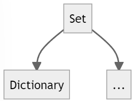
  <figcaption>Fig. Hierarchy of set interface and dictionary.</figcaption>
</figure>
</center>


## 2.3. Sequence Implementations

Here, we will discuss 3 data structures which have implemented the sequence interface.

<center>
<figure>
  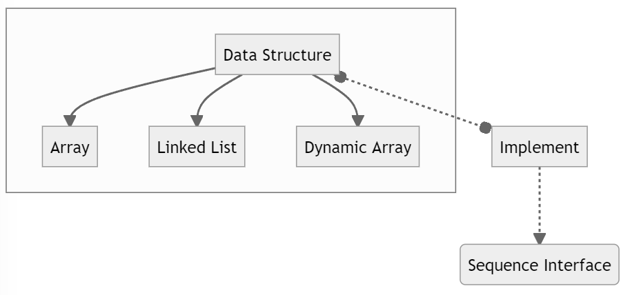
  <figcaption>Fig. The data structure which implement the sequence interface.</figcaption>
</figure>
</center>

The performance of each can be illustrated as followed:

<center>
<figure>
  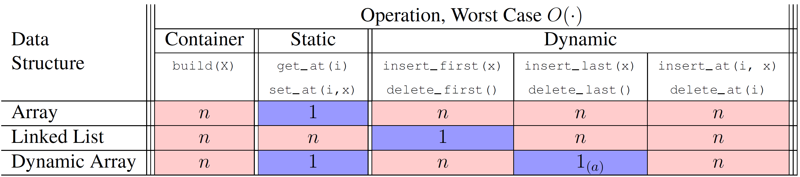
  <figcaption>Fig. The performance of data structure which has implemented the sequence interface.</figcaption>
</figure>
</center>


### 2.3.1. Array Sequence

The array sequence here actually refers to **static** array with fixed size.

> ​	:thumbsup:**Advantage**: Great for static operations.    e.g. `get_at(i)` and `set_at(i,x)` in $\Theta(1)$ time

> ​	:thumbsdown:**Disadvantage**: Bad for dynamic operations. e.g. inserting and removing items require :one:reallocating the array:two:shifting all items after the modified item.


📌**Diagram of Array**

<center>
<figure>
  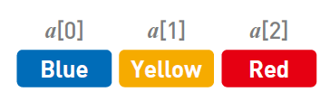
  <figcaption>Fig. What Array is.</figcaption>
</figure>
    <figure>
  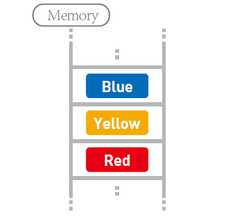
  <figcaption>Fig. What Array is in memory.</figcaption>
</center>


### 2.3.2. Linked List Sequence

<u>Linked List Sequence</u> is a **Pointer data structure** where each item stored in a node containing a pointer to the next node in sequence. Each node has *2* fields: `node.item` and `node.next`

:thumbsup:**Advantage**: insert and delete from the front in $\Theta(1)$ time!

:thumbsdown:**Disadvantage**: `get_at(i)` and `set_at(i,x)` in worst take $\Omicron(n)$ time


📌**Diagram of Linked List**

<center>
<figure>
  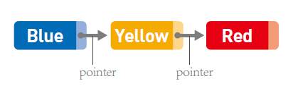
  <figcaption>Fig. What Linked List is.</figcaption>
</figure>
    <figure>
  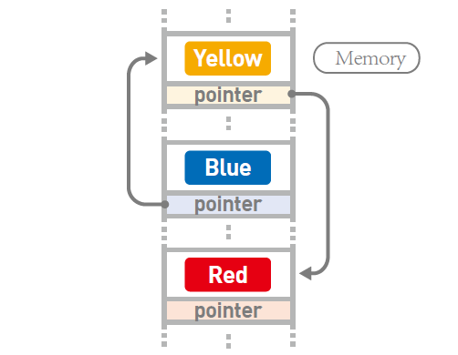
  <figcaption>Fig. What Linked List actually is in memory.</figcaption>
</figure>
        <figure>
  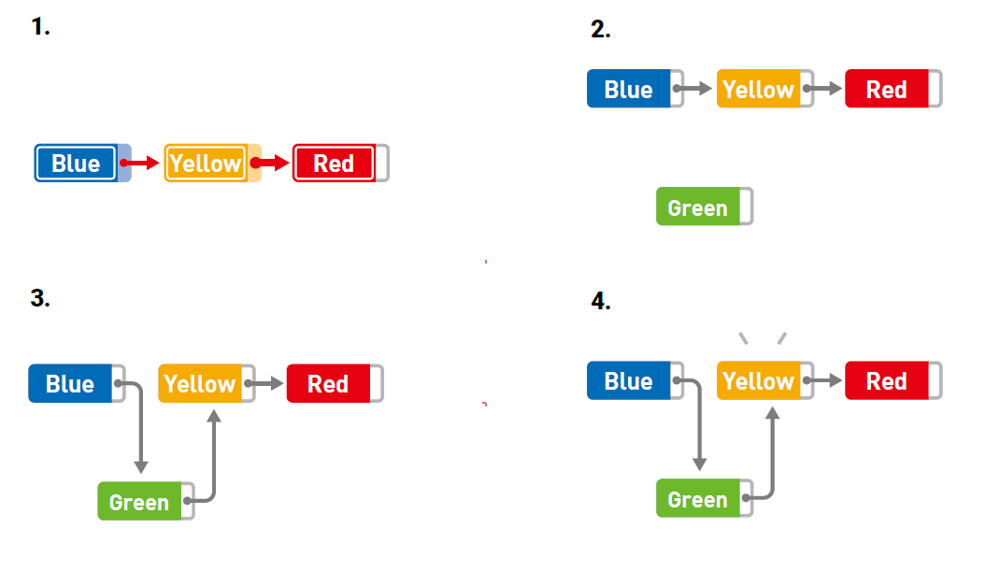
  <figcaption>Fig. How to insert item to Linked List.</figcaption>
</figure>
</center>


📌Why **`get_at(i)` and `set_at(i,x)`** will take $\Omicron(n)$?

See the difference inside memory between Array and Linked List.

- Array:  the address of each item in memory is continous.
- Linked List:  the address is NOT continuous, the address of $i$-th item is recored by $i-1$-th item


### 2.3.3. Dynamic Array Sequence

The idea behind Dynamic Array Sequence is that **allocate extra space** so reallocation does not occur with every dynamic operation. 

📌**Fun Fact of Dynamic Array**

The `list` in Python is dynamic array.

📌**How does it work?**

:one:First we denote the fill ratio as $r$ which $0\leq r\leq 1$

:two:Whenever the array is full ($r=1$), allocate $\Theta(n)$ extra space at end to fill ratio $r_i$ (e.g., 1/2). 

:three: Insert $\Theta(n)$ items before the next reallocation


📌**Diagram**

<div align="center">
<figure>
  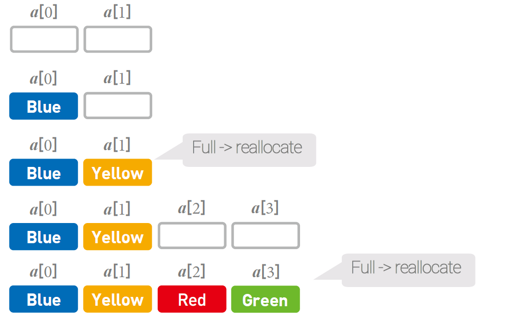
  <figcaption>Fig. How dynamic array work.</figcaption>
</figure>
</div>


📌**What is the Pros and Cons of this Dynamic Allocation?**

> ​	<u>Pros</u>:smile:: When request space for the array, there **are always over-allocate additional space**.

> ​	<u>Cons</u>:no_mouth:: 
>
> ​				**Additional space reserved** will mean **less space is available** for other programs.
>
> ​				Any additional allocation will be bounded **the array will again need to be reallocated** and copied over

📌**What is the strategy to this problem?**

> ​	:star:In short, the strategy is to **amortize the time on reallocation** so that any sequence of $n$ insertions only takes **at most** $\Omicron(n)$ time!

📌**Why does this strategy work?**

> ​	:star: Because such linear time reallocation operations **do not occur often**, so insertion will take $\Omicron(1)$ time per insertion on average.

📌**Amortized Constant Time**

> ​	We call this asymptotic running time **amortized constant time**.

📌**What is the strategy exactly?**

> ​	:star::heavy_check_mark: The strategy is to to **allocate extra space in proportion to the size** of the array being stored. 
>
> ​	:x: This strategy **does not allocate constant fraction of additional space**. Because it will achieve the amortized bound.

 Python Lists allocate additional space according to the following formula (from the Python source code written in C):

```c
new_allocated = (newsize >> 3) + (newsize < 9 ? 3 : 6);
```

The `new_allocated` number means **the additional length required adding** to the original array.

📌**Convention Proportion of New Allocation**

> ​	Adding(like `append`): when the length reaches the max length, expand the size to $2n$. 
>
> ​	Removing(like `pop`): when the length is reduced to $\frac{1}{4}$ of original length, shrink the size to $\frac{1}{2}$


# 3.Sorting


# Appendix

📌**Data structure and Interface**

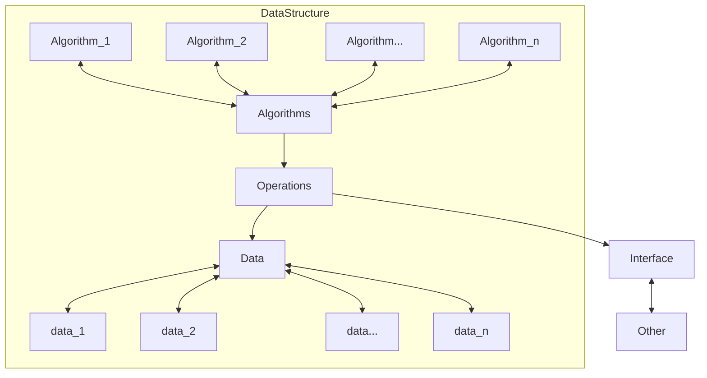

📌**stack and queue**

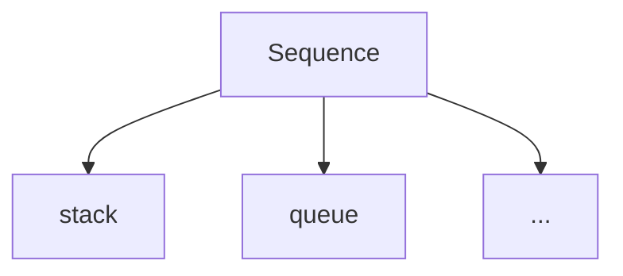

📌**dictionary**

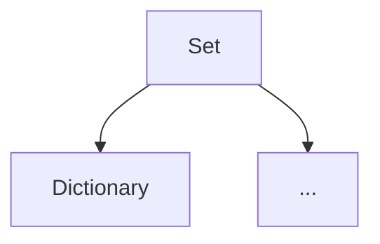

