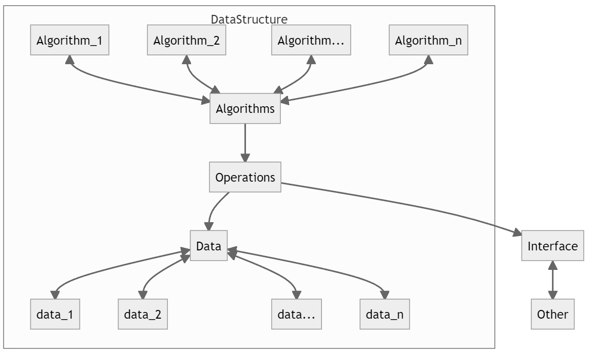

# The Algorithms
 This is the repo I learned MIT 6.006 Introduction to Algorithms.

# 1.Introduction

:dart: The goal is to **solve** computation problems, and to **communicate** that your solutions are **correct** and **efficient**.

This lecture covers following topics:

- algorithm - to know what it is first
- correctness - then to define what is correct
- efficiency - evaluate the efficiency
- model of computation - how to compute and integrate algorithm in computation
- data structure - how data structure can help
- runtime analysis - having all set up, it's time to analyze


## 1.1. Algorithm

:pushpin:**What is a algorithm?**

It has following properties:

- Procedure mapping each input to a **single** output (deterministic)

- Algorithm **solves** a problem if it returns a correct output for every problem input


:pushpin:**Example of an algorithm**

An algorithm to see whether there are students with same birthday in a same classroom.

A. Maintain a record of names and birthdays(initially empty)

B. Interview each student(loop)

​	B.1. *if* birthday exists in record, return found(**true**)

​	B.2. *else* add name and birthday to record(**false**)

C. Return **None** if last interviewed student without success


## 1.2. Correctness

:thinking: **How** to **prove** the **correctness** of an algorithm?

- For **small** inputs, can use case analysis
- :star:For arbitrarily **large** inputs, algorithm must be **recursive** or **loop**
  - Normally use **induction** to prove the correctness


:pushpin:**Example of Proof**

Following are the steps of proof on the last birthday matching problem.

1. Induct on $k$: the number of students in the classroom
2. **Hypothesis**: if first $k$ contains match, returns match(TRUE) before asking $k+1$ student
3. **Base case**: $k=0$, first $k$ does not contain match
4. Assume for induction hypothesis holds for $k = k'$, and consider $k = k' +1$ (saying in coding context, if not found, continue...)
5. If first $k'$ contains a match, already returned a match by induction
6. Else first $k'$ do not have match, so if first $k' +1$ has match, match contains $k' +1$
7. Then algorithm checks directly whether birthday of student $k' +1$ exists in first $k'$


:page_with_curl:Side Notes:

$k'$​ is nothing else but an arbitrary number


## 1.3. Efficiency

Once the algorithm is proved correct, it has to be measured in efficiency. 


:pushpin:**What is the rule to measure efficiency?**

- **machine independent** -> meaning we don't evaluate with machines because a same algorithm may have different performance on different computer!
- **Quantify OPS** -> meaning counting number of fixed-time operations algorithm takes to return
- **inputs:arrow_up_small:time:arrow_up_small:** -> meaning the size of input directly affect the time of computation
- **$n$** -> usually the amount of input is denoted as $n$
- **polynomial $n^c$​** -> meaning the algorithm is efficient enough if it returns in polynomial computation time with respect to amount of input
- **None** -> meaning sometimes an efficient algorithm does not exist.


:pushpin: **Asymptotic Notation**

$\Omicron$ - Upper bounds

$\Omega$ - Lower bounds

$\Theta$ - tight bounds

$\in$ - is

$=$ - order


:pushpin:**Example of Asymptotic Notation**

The following equations

1. *T*(*n*) = $\Omicron(n^{100})$
2. *T*(*n*) = $\Omega(n^3)$
3. *T*(*n*) = $\Theta(n^3)$

in English

1. *T*(*n*) grows asymptotically **no faster** than $n^{100}$
2. *T*(*n*) grows asymptotically **no slower** than $n^3$
3. *T*(*n*) grows asymptotically **as fast as** $n^3$


:pushpin:**Efficiency Table**

| input | constant    | logarithmic      | linear      | log-linear        | quadratic      | polynomial    | exponential                 |
| ----- | ----------- | ---------------- | ----------- | ----------------- | -------------- | ------------- | --------------------------- |
| $n$   | $\Theta(1)$ | $\Theta(\log n)$ | $\Theta(n)$ | $\Theta(n\log n)$ | $\Theta (n^2)$ | $\Theta(n^c)$ | $2^{\Theta(n^c)}$           |
| 1000  | 1           | $\approx$10      | 1000        | $\approx$10,000   | 1,000,000      | 1000$^c$      | 2$^{1000}\approx$10$^{301}$ |
| Time  | 1 $ns$      | 10 $ns$          | 1 $\mu s$   | 10$\mu s$         | 1$ms$          | 10$^{3c-9}$s  | 10$^{281}$ millenia         |


:pushpin:**Efficiency Chart**


## 1.4. Model of Computation

:pushpin:**Why?**

To **precisely calculate** the resources used by an algorithm, we need to model how long a computer takes to perform basic operations.

:pushpin:**What is RAM?**

RAM is Random Access Memory. It is an internal memory that **exchanges data directly with the CPU**.

:pushpin:**What is Word-RAM**?

In reality, the interaction between CPU and RAM can be very **complicated**. Therefore in this class, the lecturers coined Word-RAM:laughing:. A Word-RAM processor can perform basic binary operations on two machine words in constant time. 

:pushpin:**Example of Word-RAM**

$w$-bits Word-RAM allows you to read and write from at most $2^w$ addresses in memory.

$4$-bits Word-RAM allows you to read and write from at most $16$ addresses in memory. Like:

| 1    | 2    | 3    | 4    | 5    | 6    | 7    | 8    | 9    | 10   | 11   | 12   | 13   | 14   | 15   | 16   |
| ---- | ---- | ---- | ---- | ---- | ---- | ---- | ---- | ---- | ---- | ---- | ---- | ---- | ---- | ---- | ---- |
| V    | J    | O    | T    | R    | B    | L    | R    | E    | S    | V    | Z    | P    | O    | M    | B    |

:pushpin:**Requirement of $w$**

Suppose we need to read $n$ words, what is the **minimum** bits of this Word-RAM?
$$
\begin{align}
2^w &> n\\w&>\log_2(n)
\end{align}
$$
:pushpin:**Basic Operation on processor**

Normally, we suppose the processor supports many **constant time operations** on a $\Omicron(1)$ number of words (integers):

- **integer arithmetic**: $(+, -, *, /, \%)$
- **logical operators**: $(\&\&, ||, !, ==, <, >, <=, =>)$
- **bitwise arithmetic**: $(\&, |, <<, >>, ...)$
- **read & write**: Given word $a$, can read word at address $a$, write word to address $a$


## 1.5. Data Structures

:pushpin:**What is data structure?**

A **data structure** is **a way to store a non-constant amount of data**, supporting a set of operations to interact with that data.


:pushpin:**What is interface?**

The set of operations supported by a data structure is called an **interface**. (:warning: The interface here is not the one in C# e.g. `IEnumerable`)

Example:

- `List<T>` has the interface of `Add()`

- `Dictionary<TKey, TValue>` has the interface of `Add()`

- :warning: They are with same operation but their logic behind are highly different.


:pushpin:**Why data structures are important?**

The data structures determine **how to store data highly affect the runtime** of such a algorithm.

- Many data structures might support the same interface, but could provide different performance for each operation. 

- Many problems can be solved trivially by storing data in an appropriate choice of data structure.


:pushpin:**What is Static Array?**

- It is the most common data structure.
- It is simply a contiguous sequence of words reserved in memory, supporting a static sequence interface.

It have following interfaces:

`StaticArray(n)`  ->  allocate a new static array of size $n$ initialized to 0 in $\Theta(n)$ time

`StaticArray.get_at(i)`  ->  return the word stored at array index $i$ in $\Theta(1)$ time 

`StaticArray.set_at(i, x)`  ->  write the word $x$ to array index $i$ in $\Theta(1)$ time


:pushpin:**Solving birthday match in Python**

```python
class StaticArray:
        def __init__(self, n):
                self.data = [None] * n             # (0)Init
                                                   
                                                   # (1)get func
        def get_at(self, i):
                if not (0 <= i < len(self.data)):      # check if the index i is valid
                        raise IndexError
                return self.data[i]                    # get the data at index i

                                                   # (2)set func
        def set_at(self, i, x):
                if not (0 <= i < len(self.data)):      # check if the index is valid
                        raise IndexError
                self.data[i] = x                       # set the data at index i

def birthday_match(students):
        """
        Find a pair of students with the same birthday
        Input: tuple of student (name, bday) tuples
        Output: tuple of student names or None
        """
        n = len(students)                                        # O(1)
        record = StaticArray(n)                                  # O(n)
        for i in range(n):                                       # n
                (name_que, bday_que) = students[i]               # O(1)
                for j in range(i):                               # k   check if it is in record
                        (name_rec, bday_rec) = record[j]         # O(1)
                        if bday_rec == bday_que:                 # O(1)
                                return (name_que, name_rec)      # O(1)
                record.set_at(i, (name_que, bday_que))           # O(1)
        return None                                              # O(1)

```


## 1.6. Runtime Analysis

:pushpin: **Disclaimer**

Runtime analysis only *approximates* it! It cares the degree and coefficient of $n$ the most.


:pushpin:**Analysis of birthday match algorithm**

All the lines take constant time except for following lines with heavy computation:

- `record = StaticArray(n)` , this takes $\Theta(n)$ time to initialize the static array record.
- `for i in range(n)`, in worst case, it will loop at most $n$ times
- `for j in range(i)`, it will loop through $k$ times

:star: Here is the key: in the worst case, we have to loop over $n$ times, in the meantime, inside the $n$ loop, we have to check $k,k-1,k-2,k-3,...,0$. Hence the operation can be represented as following abstract chart.

```
⬤
⬤⬤
⬤⬤⬤
⬤⬤⬤⬤
⬤⬤⬤⬤⬤
⬤⬤⬤⬤⬤⬤
```

Therefore, it could be written as:
$$
\Omicron(n)+\sum_{k=0}^{n-1}(\Omicron(1)+k\cdot\Omicron(1))=\Omicron(n^2)
$$
:thinking: OK, you may wonder, why left hand side becomes $n^2$ (square)?! while the chart above is a triangle??

That's the disclaimer said - *approximate*. Because these 2 `for` loop can be seen as
$$
\frac{n\cdot(n-1)}{2}\approx n^2
$$
This is quadratic in $n$, which is **polynomial**! Is this efficient? No! We **can do better** by using a different data structure tailored to support a different set of operations efficiently.


## 1.7. Asymptotic Exercises

___

:page_facing_up: **Question**: 

Find a simple, tight asymptotic bound for $\Big(\begin{matrix}n\\6006\end{matrix}\Big)$.

:pencil2:**Solution:** 

Definition yields $n(n-1)...(n-6005)$ in the numerator (a degree 6006 polynomial) and 6006! in the denominator (constant with respect to $n$). So:
$$
\Big(\begin{matrix}n\\6006\end{matrix}\Big)=\Theta(n^{6006})
$$


___

:page_facing_up: **Question**: 

 Find a simple, tight asymptotic bound for $\log_{6006}\Big((\log(n^{\sqrt{n}}))^2\Big)$

:pencil2:**Solution:** 

First, we have rules for exponent and logarithm rules:
$$
\begin{align}
\log ab&=\log a+\log b\\
\log(a^b)&=b\log a\\
\log_ab&=\log b/\log a
\end{align}
$$
Therefore, we have:
$$
\begin{align}
\log_{6006}\Big((\log(n^{\sqrt{n}}))^2\Big) &=\\
&=\frac{\log(\log(n^{\sqrt{n}})^2)}
{\log6006}
\\
&=\frac{2\log(\log(n^{\sqrt{n}}))}
{\log6006}
\\
&=\frac{2}
{\log6006}\log(\log(n^{\sqrt{n}}))
\\
&=\frac{2}
{\log6006}\log(\sqrt{n}\log(n))
\\
&\approx\log(\sqrt{n}\log(n))
\\
&\approx\Theta(\log n^{1/2}+\log\log n)
\\
&\approx\Theta(\log n)
\end{align}
$$

For $\approx$, we should know:
$$
\frac{2}{\log6006}=\frac{2}{3.77}\approx1
\\
\log\log n\approx0
\\
\log n^{1/2}=\frac{1}{2}\log n\approx\log n
$$


___

:page_facing_up: **Question**: 

Show that $2^{n+1}\in\Theta(2^n)$, but that $2^{2^{n+1}}\not\in\Omicron(2^{2^n})$

:pencil2:**Solution:** 

$\Theta$, tight bound, **as fast as**

$\Omicron$, upper bound, **no faster than**

Therefore, we have to prove 

​	A.    $2^{n+1}$ **can** grow faster **or** slower than $2^n$:

Because $2^{n+1}=2\cdot2^n$, therefore $2^{n+1}$ bigger than $2^n$

​	B.    $2^{2^{n+1}}$ **MUST** grow faster than $2^{2^n}$:

Because $2^{2^{n+1}}=2^{2^n}\cdot2^2$, therefore $2^{2^{n+1}}$ bigger than $2^{2^n}$


___

:page_facing_up: **Question**: 

Show that $(\log n)^a=\Omicron(n^b)$ for all positive constants $a$ and $b$.

:pencil2:**Solution:** 

$\Omicron$, upper bound, **no faster than**

Therefore, to prove this, we have to say $(\log n)^a<n^b$ is always true. That said, if $n$ approaches $\infin$, this is true.

Goal of proof:
$$
\frac{n^b}{(\log n)^a} \to\infin\quad,\text{as } n\to\infin
$$
To prove:
$$
\begin{align}
\lim_{n\to\infin}\log(\frac{n^b}{(\log n)^a})&=\lim_{n\to\infin}(b\log n-a\log\log n)\\
&=\lim_{x\to\infin}(bx-a\log x)\\
&=\infin
\end{align}
$$


___

:page_facing_up: **Question**: 

Show that $(\log n)^{\log n}=\Omega(n)$

:pencil2:**Solution:** 

Since $m^m=\Omega(2^m)$, so setting $n=2^m$ completes the proof.


___

:page_facing_up: **Question**: 

Show that $(6n)!\not\in\Theta(n!)$, but that $\log((6n)!)\in\Theta(\log(n!))$

:pencil2:**Solution:** 

Sterling's approximation:
$$
n!=\sqrt{2\pi n}\Big(\frac{n}{e}\Big)^n\Bigg(1+\Theta(\frac{1}{n})\Bigg)
$$
Substituting in $6n$ gives an expression that is at least $6^{6n}$ larger than the original. But taking the logarithm of Sterling’s gives $\log(n!) = \Theta(n \log n)$, and substituting in $6n$ yields only constant additional factors.


## 1.8. Road Map of this Course:star:


# 2.Data Structures

:pushpin:**Review of Data Structure and Interface**

When you think of *data structure* and *interface*, please do combine them altogether! From my point of view, their relationship is:


<center>
<figure>
  
  <figcaption>Fig.Interface is an interface of data structure.</figcaption>
</figure>
</center>


| Data Structure                                              | Interface                                              |
| ----------------------------------------------------------- | ------------------------------------------------------ |
| A way to store data with algorithms that support operations | A collection of supported operations                   |
| a **representation**: **how** operations are supported      | a **specification**: **what** operations are supported |
| the solution!                                               | the problem!                                           |


In this class, we will work on **2** main interfaces: **Sequence** and **Set**.


## 2.1. Sequence Interface

:pushpin:**What is a sequence?**

Sequences maintain a collection of items in an **extrinsic** order, where each item stored has **a rank in the sequence**, including a first item and a last item.

:pushpin:**What does it mean by `extrinsic`?**

By extrinsic, we mean that the first item is ‘first’, not because of what the item is, but **because some external party put it there**. In short, the first is because it is THE first.

:pushpin:**Properties of sequence**

Therefore, we can conclude that the sequence interface has following properties:

- :one:Maintain a sequence of items (order is **extrinsic**)    e.g. ($x_0,x_1,x_2,...,x_{n−1}$) (zero indexing)
- :two:Use $n$ to denote the number of items stored in the data structure
- :three:Supports following operations:

| Function Categories | Function                                                     | Function Description                                         |
| ------------------- | ------------------------------------------------------------ | ------------------------------------------------------------ |
| Container           | `build(X)`<br />`len()`                                      | given an iterable $X$ build sequence from items in $X$ <br/>return the number of stored items |
| Static              | `iter_seq()`<br/>`get_at(i)`<br/>`set_at(i, x)`              | return the stored items one-by-one in sequence order<br/>return the $i^{th}$ item<br/>replace the $i^{th}$ item with $x$ |
| Dynamic             | `insert_at(i, x)`<br/>`delete_at(i)`<br/>`insert_first(x)`<br/>`delete_first()`<br/>`insert_last(x)`<br/>`delete_last()` | add $x$ as the $i^{th}$ item <br/>remove and return the $i^{th}$ item <br/>add $x$ as the first item <br/>remove and return the first item <br/>add $x$ as the last item <br/>remove and return the last item |

**:pushpin:Special case of sequence: `stack` and `queue`**

Sequences are generalizations of `stacks` and `queues`, which support a subset of sequence operations. The hierarchy is the following:

<center>
<figure>
  
  <figcaption>Fig. Hierarchy of stack and queue.</figcaption>
</figure>
</center>

`stack` supports:

- `insert_last(x)`
- `delete_last()`

`queue` supports:

- `insert_last(x)`
- `delete_first()`


## 2.2. Set Interface

:pushpin:**What is a set?**

Sets maintain a collection of items based on an **intrinsic** property.

:pushpin:**What does it mean by `intrinsic`?**

By intrinsic, it means what the items are, usually based on a unique key, `x.key`, associated with each item `x`.

:pushpin:**Properties of set**

Therefore, we can conclude that the set interface has following properties:

- :one:Maintain a set of items having **unique** keys:    e.g. item `x` has key `x.key`   
- :two:Supports following operations:

| Function Categories | Function                                                     | Function Description                                         |
| ------------------- | ------------------------------------------------------------ | ------------------------------------------------------------ |
| Container           | `build(x)`<br/>`len()`                                       | given an iterable $X$, build set from items in $X$<br/>return the number of stored items |
| Static              | `find(k)`                                                    | return the stored item with key `k`                          |
| Dynamic             | `insert(x)`<br/>`delete(k)`                                  | add `x` to set (replace item with key `x.key` if one already exists)<br/>remove and return the stored item with key `k` |
| Order               | `iter_ord()`<br/>`find_min()`<br/>`find_max()`<br/>`find_next(k)`<br/>`find_prev(k)` | return the stored items one-by-one in key order <br/>return the stored item with smallest key <br/>return the stored item with largest key <br/>return the stored item with smallest key larger than `k` <br/>return the stored item with largest key smaller than `k` |

**:pushpin:Special case of set: `Dictionary`**

Sets are generalizations of `Dictionary` and other intrinsic query databases. The hierarchy is the following:

<center>
<figure>
  
  <figcaption>Fig. Hierarchy of set interface and dictionary.</figcaption>
</figure>
</center>


## 2.3. Sequence Implementations

Here, we will discuss 3 data structures which have implemented the sequence interface.

<center>
<figure>
  
  <figcaption>Fig. The data structure which implement the sequence interface.</figcaption>
</figure>
</center>

The performance of each can be illustrated as followed:

<center>
<figure>
  
  <figcaption>Fig. The performance of data structure which has implemented the sequence interface.</figcaption>
</figure>
</center>


### 2.3.1. Array Sequence

The array sequence here actually refers to **static** array.

:thumbsup:**Advantage**: Great for static operations.    e.g. `get_at(i)` and `set_at(i,x)` in $\Theta(1)$ time

:thumbsdown:**Disadvantage**: Bad for dynamic operations. e.g. inserting and removing items require :one:reallocating the array:two:shifting all items after the modified item.

//TODO complete description here


### 2.3.2. Linked List Sequence

<u>Linked List Sequence</u> is a **Pointer data structure** where each item stored in a node containing a pointer to the next node in sequence. Each node has *2* fields: `node.item` and `node.next`

:thumbsup:**Advantage**: insert and delete from the front in $\Theta(1)$ time!

:thumbsdown:**Disadvantage**: `get_at(i)` and `set_at(i,x)` in worst take $\Omicron(n)$ time

//TODO complete description here


### 2.3.3. Dynamic Array Sequence

The idea behind Dynamic Array Sequence is that **allocate extra space** so reallocation does not occur with every dynamic operation. 

:pushpin:**Fun Fact of Dynamic Array**

The `list` in Python is dynamic array.

:pushpin:**How does it work?**

:one:First we denote the fill ratio as $r$ which $0\leq r\leq 1$

:two:Whenever the array is full ($r=1$), allocate $\Theta(n)$ extra space at end to fill ratio $r_i$ (e.g., 1/2). 

:three: Insert $\Theta(n)$ items before the next reallocation

//TODO diagram illustrate this


:pushpin:**What is the Pros and Cons of this Dynamic Allocation?**

> ​	<u>Pros</u>:smile:: When request space for the array, there **are always over-allocate additional space**.

> ​	<u>Cons</u>:no_mouth:: 
>
> ​				**Additional space reserved** will mean **less space is available** for other programs.
>
> ​				Any additional allocation will be bounded **the array will again need to be reallocated** and copied over

:pushpin:**What is the strategy to this problem?**

> ​	:star:In short, the strategy is to **amortize the time on reallocation** so that any sequence of $n$ insertions only takes **at most** $\Omicron(n)$ time!

:pushpin:**Why does this strategy work?**

> ​	:star: Because such linear time reallocation operations **do not occur often**, so insertion will take $\Omicron(1)$ time per insertion on average.

:pushpin:**Amortized Constant Time**

> ​	We call this asymptotic running time **amortized constant time**.

:pushpin:**What is the strategy exactly?**

> ​	:star::heavy_check_mark: The strategy is to to **allocate extra space in proportion to the size** of the array being stored. 
>
> ​	:x: This strategy **does not allocate constant fraction of additional space**. Because it will achieve the amortized bound.

 Python Lists allocate additional space according to the following formula (from the Python source code written in C):

```c
new_allocated = (newsize >> 3) + (newsize < 9 ? 3 : 6);
```

The `new_allocated` number means **the additional length required adding** to the original array.

:pushpin:**Convention Proportion of New Allocation**

> ​	Adding(like `append`): when the length reaches the max length, expand the size to $2n$. 
>
> ​	Removing(like `pop`): when the length is reduced to $\frac{1}{4}$ of original length, shrink the size to $\frac{1}{2}$


# 3.Sorting


# Appendix

:pushpin:**Data structure and Interface**


:pushpin:**stack and queue**


:pushpin:**dictionary**


